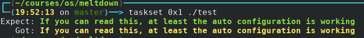
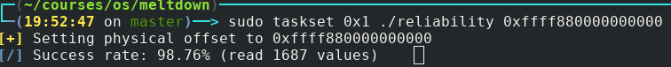
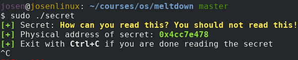
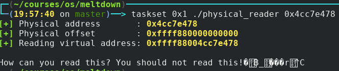

### 实验平台

- 系统：`Linux josenlinux 4.17.2-1-ARCH #1 SMP PREEMPT Sat Jun 16 11:08:59 UTC 2018 x86_64 GNU/Linux`
- CPU：`Intel(R) Core(TM) i7-7500U CPU @ 2.70GHz`

### 系统参数设置

- 关闭meltdown补丁和kaslr：在内核启动参数中添加`nopti`和`nokaslr`参数
- 设置CPU频率：`sudo cpupower frequency-set -g performance `
  - 提高CPU频率有助于复现实验结果

### 实验说明

- 实验使用了meltdown论文里提到的github仓库[meltdown](https://github.com/IAIK/meltdown)
- 没有另外写新的，故仓库里空空如也

### 实验原理及流程

- 以下是论文里的说明

> Step 1 The content of an attacker-chosen memory loca-
> tion, which is inaccessible to the attacker, is loaded
> into a register.
> Step 2 A transient instruction accesses a cache line
> based on the secret content of the register.
> Step 3 The attacker uses Flush+Reload to determine the
> accessed cache line and hence the secret stored at the
> chosen memory location.

- 以下是实际攻击代码（Step 1、2）

  ```c
  #define meltdown_nonull                                                        \
    asm volatile("1:\n"                                                          \
                 "movzx (%%rcx), %%rax\n"                                        \
                 "shl $12, %%rax\n"                                              \
                 "jz 1b\n"                                                       \
                 "movq (%%rbx,%%rax,1), %%rbx\n"                                 \
                 :                                                               \
                 : "c"(phys), "b"(mem)                                           \
                 : "rax");
  ```

- 接着以`flush/reload`的方式检测出被读取的内容（Step 3）

  - `libkdump_read_tsx()`，以TSX（一种硬件加锁方式）的机制处理中断
  - `libkdump_read_signal_handler()`，以设置信号处理函数的方式处理中断

- meltdown仓库的部分说明

  - `sched_yield()`函数用于释放CPU
  - `setjmp`和`longjmp`为非局部跳转，类似`goto`
  - 汇编命令`mfence`：之前的访存类指令均执行完再执行下面指令
  - 汇编命令`rdtsc`：读取计时器值
  - 汇编命令`clflush`：使对应cache line无效化
  - `libkdump_virt_to_phys`：虚拟地址转化为物理地址
    - `/proc/pid/pagemap`具体可参阅[pagemap](https://www.kernel.org/doc/Documentation/vm/pagemap.txt)
    - 虚拟地址对应页表项在`pagemap`偏移量为：(虚拟地址 / 页表大小) * 页表项大小

### 实验结果

- Demo #1: A first test (`test`)



- Demo #2: Breaking KASLR (`kaslr`)：已关`kaslr`

- Demo #3: Reliability test (`reliability`)



- Demo #4: Read physical memory (`physical_reader`)





- Demo #5: Dump the memory (`memdump`)：失败

